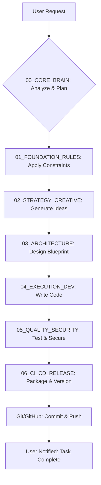

# AXIS Architectural Flowcharts

This document contains visual diagrams (using Mermaid syntax) that illustrate the core processes and data flows within the AXIS OS.

---

## 1. High-Level Task Workflow

This chart shows the end-to-end process of a task flowing through the AXIS modules, from initial user request to final release.



---

## 2. Core Data Flow

This chart illustrates how data moves between the Shopify platform, the theme's user interface, and the AXIS AI's internal systems.

```mermaid
graph TD
    subgraph "Shopify Platform"
        Shopify_Data[Shopify Data <br/> (Products, Collections, etc.)]
    end

    subgraph "Theme User Interface"
        Liquid[Liquid Templates]
        JS[JavaScript Modules]
    end
    
    subgraph "AXIS AI System"
        Knowledge[Knowledge Base <br/> (JSON/MD Files)]
        Memory[18_AXIS_MEMORY_LOG.json]
    end

    Shopify_Data --> |Rendered into| Liquid;
    Liquid --> |Interacted by User| JS;
    JS --> |Sends analytics & events| Memory;
    Knowledge --> |Informs AI decisions| B(AI Brain);
    Memory --> |Learns from past| B;
    B --> |Generates/Modifies Code| Liquid;
    B --> |Generates/Modifies Code| JS;
```

---

## 3. `axis save` & Backup Process

This chart visualizes the automated save, commit, and backup process handled by our PowerShell scripts (`save.ps1`, `deploy_axis.ps1`).

```mermaid
graph TD
    Start[dev:~$ axis save "message"] --> CheckGit{Any Changes?};
    CheckGit -- No --> End[Exit: Nothing to commit];
    CheckGit -- Yes --> Add[git add .];
    Add --> Commit[git commit -m "message"];
    Commit --> Push[git push origin main];
    Push --> Robocopy[robocopy /MIR];
    Robocopy --> GDrive[Backup to Google Drive];
    GDrive --> End;
```
