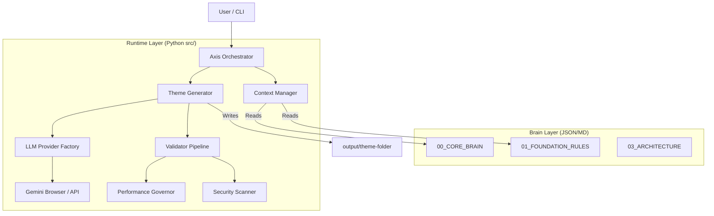

# Technical Architecture Audit

## 1. System Overview

AXIS Studio operates on a **Bi-Cameral Architecture**, separating the "Mind" (Constitutional Rules & Knowledge) from the "Body" (Execution Runtime).

### High-Level Diagram

## 2. Component Analysis

### A. The Brain (`00_CORE_BRAIN` - `08_INTEGRATIONS`)
*   **Role:** Acts as the database of logic, rules, constraints, and strategy.
*   **Format:** Primarily JSON (machine-readable) and Markdown (human-readable/LLM-context).
*   **Key File:** `axis_brain_v10.0_GOD_MODE.json` defines the master strategy.
*   **Assessment:** Very mature. The data structure is comprehensive. However, it currently contains a "BOM" (Byte Order Mark) issue in `axis_brain_v10.0_GOD_MODE.json` which causes the Python JSON loader to fail (detected in audit log).
    *   *Correction Needed:* Remove UTF-8 BOM from JSON files.

### B. The Runtime Engine (`src/`)
This is the operational core.

#### 1. Orchestrator (`src/orchestrator.py`)
*   **Function:** Loads the `AI_BEHAVIOR_TREE` and executes tasks.
*   **Current State:** It implements a simple command pattern (`command`, `file_create`, `file_read`).
*   **Limitation:** It currently executes a linear list. It lacks the complex decision-making loops described in the brain files (e.g., "If validation fails, retry X times").

#### 2. Theme Generator (`src/core/generator.py`)
*   **Function:** Specific logic to build Shopify themes.
*   **Current State:** Contains hardcoded steps:
    1.  Config (`settings_schema.json`)
    2.  Layout (`theme.liquid`)
    3.  Assets (`base.css`)
    4.  Sections (`hero.liquid`)
    5.  Templates (`index.json`)
*   **Critique:** This coupling violates the "Autonomous" promise. The generator should read the *Blueprint* and dynamically determine the build order. Currently, adding a new section requires changing Python code, not just the JSON blueprint.

#### 3. Context Manager (`src/core/context.py`)
*   **Function:** Loads configuration and brain files.
*   **Current State:** Functional. It recursively loads JSON files from the brain directory.
*   **Gap:** No token management. It loads files into memory but doesn't yet intelligently select *which* parts of the brain to send to the LLM to fit within context windows.

#### 4. LLM Provider (`src/adapters/`)
*   **Function:** Interface with AI models.
*   **Current State:**
    *   `LLMProvider`: Clean abstract base class.
    *   `GeminiBrowserProvider`: Uses Selenium.
*   **Risk:** Extremely high fragility. Reliance on CSS selectors (`textarea[placeholder*='Enter a prompt']`) means Google can break this tool at any moment. API integration is mandatory for stability.

#### 5. Quality & Security (`src/utils/`)
*   **PerformanceGovernor:** Checks file sizes against budget. Functional.
*   **SecurityScanner:** Regex-based scanner for XSS/eval(). Functional and fast.
*   **Assessment:** These are solid "Shift Left" tools. They need to be integrated into a "Pre-Commit" hook or "Post-Generation" check loop.

## 3. Data Flow

1.  **Input:** User runs `axis create-theme "Brief"`.
2.  **Context Loading:** `AxisContext` loads `axis.config.json` and `00_CORE_BRAIN`.
3.  **Prompt Assembly:** `ThemeGenerator` constructs a prompt:
    *   `ACT AS: Senior Developer`
    *   `CONTEXT: {Rule from Brain}`
    *   `TASK: Write {filename}`
4.  **LLM Execution:** Provider (e.g., Gemini) generates code.
5.  **Output:** Code is cleaned (markdown stripping) and written to `output/{theme_name}/{filename}`.

## 4. Architecture Grade: B
The separation of concerns is excellent. The code is clean, modular, and typed (Python Type Hints). The main deficit is the **rigidity of the Generator** vs. the **fluidity of the Brain**. The Python code needs to become more generic to fully leverage the JSON definitions.
