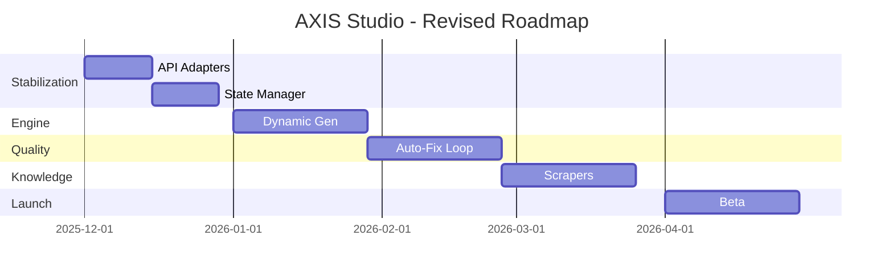

# Revised Roadmap

**Current Date:** November 2025
**Target Launch:** May 2026 (6 Month Plan)

The original roadmap was sound but underestimated the effort for a robust Runtime Engine. This revised plan prioritizes stability over new features.

## Phase 1: Core Stabilization (Weeks 1-4)
*Goal: Move from "Prototype" to "Alpha".*
- [ ] **LLM API Integration:** Replace/Augment `gemini_browser` with official API adapters.
- [ ] **JSON Cleanup:** Fix BOM issues in Brain files.
- [ ] **State Manager:** Implement `src/core/state.py` to save/resume progress.
- [ ] **Context Router:** Basic token counting and selective file loading.

## Phase 2: Dynamic Engine (Weeks 5-8)
*Goal: Make the Python engine fully data-driven.*
- [ ] **Refactor Generator:** Remove hardcoded steps in `ThemeGenerator`.
- [ ] **Blueprint Driver:** Implement logic to walk the `AI_THEME_BLUEPRINT` tree.
- [ ] **Dependency Resolution:** Ensure `layout.theme` is built before `templates/index.json`.

## Phase 3: The Quality Loop (Weeks 9-12)
*Goal: Autonomous self-correction.*
- [ ] **Scanner Integration:** Connect `SecurityScanner` output to LLM.
- [ ] **Lighthouse Integration:** Add `PerformanceGovernor` checks to the build loop.
- [ ] **Retry Logic:** "If validation fails, retry generation (Max 3 attempts)."

## Phase 4: Knowledge & Scrapers (Weeks 13-16)
*Goal: Live data ingestion.*
- [ ] **Knowledge Syncer:** Implement scraper for Shopify Changelog.
- [ ] **Design Trend Scraper:** Simple scraper for Awwwards (optional/text-based).
- [ ] **Brain Update Logic:** Mechanism to merge new knowledge into JSON files.

## Phase 5: CI/CD & Packaging (Weeks 17-20)
*Goal: Production readiness.*
- [ ] **CLI Polish:** `axis init`, `axis config` wizards.
- [ ] **Packaging:** Auto-zip generation with versioning.
- [ ] **Docs:** Generate static documentation site from `07_TEAM_DOCS`.

## Phase 6: Beta Launch (Weeks 21-24)
*Goal: User feedback.*
- [ ] **Closed Beta:** Release to 10 friendly developers.
- [ ] **Bug Fixes:** 4 weeks of dedicated polish.
- [ ] **Public Release:** v1.0.0.

## Roadmap Visualization

